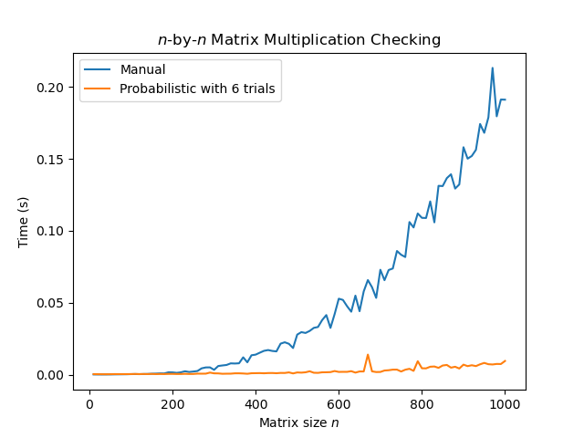
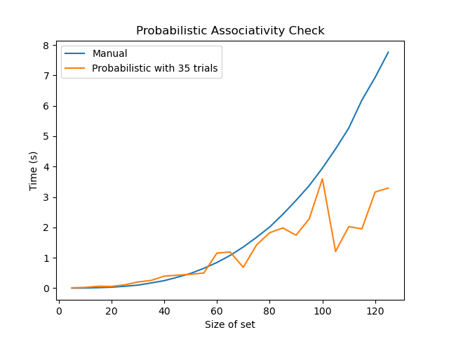

# Probabilistic Checking
 
We implement probabilistic checking for matrix multiplication
and associativity of binary operations. While not having 
perfect accuracy, the probabilistic method can provide 
answers with low error rate within a relatively short
running time compared to the deterministic method.
For reference, see section 13.6 of the book 
*Invitation to Discrete Mathematics* by 
Jiri Matousek and Jaroslav Nesetril.

 ## Matrix multiplication

We randomly generate two matrices of size n by n,
compute their product, and change only one entry. 
We then check whether the product is correct.
The deterministic method manually checks every entry, 
while the probabilistic method randomly checks a few 
linear combinations of the columns. 
We compare the running time of the two methods, which are

and 
,
respectively. With 6 trials for the probabilistic method, 
the theoretical error rate is less than 1 percent.

 ## Associativity checking

We generate a binary operation which is almost associative,
except for one triple of elements:

We then check whether the operation is associative.
The deterministic method manually checks every triple,
while the probabilistic method randomly checks a few
triples in a vector space formulation of the operation.
The running time is as follows:

With 35 trials, the error rate is less than 
1 percent. We see that in the long run, 
the probabilistic method is more efficient.

For the multiplcation above, we run the probabilistic method
with different numbers of trials to see the
improvement in accurracy:

